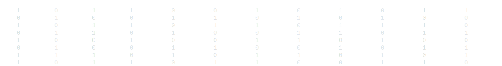

<!-- 
  SETUP: Place 'header-binary-rain.svg' and 'footer-binary-rain.svg' in the root of your SahilMukadam repo.
  The paths below assume they are in the same repo as this README.
-->
<p align="center">
  
</p>

<p align="center">
  <a href="https://www.linkedin.com/in/sahil-mukadam/"></a>
  <a href="mailto:s.mukadamwrk@gmail.com"></a>
  <a href="https://github.com/SahilMukadam"></a>
  
</p>

<!-- Typing SVG — width increased to 850, NOT wrapped in a link so clicking does NOT redirect -->
<p align="center">
  
</p>

---

### `> whoami`

```python
class SahilMukadam:
    
    role       = "AI/ML Engineer & Data Scientist"
    education  = "MSc Computer Science (Distinction) — Queen Mary University of London"
    experience = "~2 years @ Persistent Systems + Freelance AI Model Training"
    
    languages  = ["Python", "Go", "SQL", "Haskell", "JavaScript", "C"]
    ai_ml      = ["Scikit-learn", "TensorFlow", "PyTorch", "Pandas", "NumPy", "OpenCV"]
    backend    = ["Flask", "REST APIs", "AWS Lambda", "DynamoDB"]
    databases  = ["PostgreSQL", "MongoDB", "MySQL"]
    
    interests  = ["Predictive Modelling", "Digital Twins", "GenAI", "MLOps", "Social Impact Tech"]
    
    currently_building = "AI-driven Traffic Congestion Prediction with SUMO Digital Twin Simulation"
    looking_for        = "Data Scientist / ML Engineer / AI Engineer roles — UK, Europe, India, Middle East"
```

---

### `> tech_stack.load()`

<h4 align="center">⚡ Languages</h4>
<div align="center">
  <table>
    <tr>
      <td align="center" width="96">
        <a href="https://www.python.org/">
          
        </a>
        <br><b>Python</b>
      </td>
      <td align="center" width="96">
        <a href="https://go.dev/">
          
        </a>
        <br><b>Go</b>
      </td>
      <td align="center" width="96">
        <a href="https://www.haskell.org/">
          
        </a>
        <br><b>Haskell</b>
      </td>
      <td align="center" width="96">
        <a href="https://developer.mozilla.org/en-US/docs/Web/JavaScript">
          
        </a>
        <br><b>JavaScript</b>
      </td>
      <td align="center" width="96">
        <a href="https://en.cppreference.com/w/c">
          
        </a>
        <br><b>C</b>
      </td>
      <td align="center" width="96">
        <a href="https://www.mysql.com/">
          
        </a>
        <br><b>SQL</b>
      </td>
    </tr>
  </table>
</div>

<h4 align="center">🧠 AI / ML & Data Science</h4>
<div align="center">
  <table>
    <tr>
      <td align="center" width="96">
        <a href="https://www.tensorflow.org/">
          
        </a>
        <br><b>TensorFlow</b>
      </td>
      <td align="center" width="96">
        <a href="https://pytorch.org/">
          
        </a>
        <br><b>PyTorch</b>
      </td>
      <td align="center" width="96">
        <a href="https://scikit-learn.org/">
          
        </a>
        <br><b>Scikit-learn</b>
      </td>
      <td align="center" width="96">
        <a href="https://pandas.pydata.org/">
          
        </a>
        <br><b>Pandas</b>
      </td>
      <td align="center" width="96">
        <a href="https://numpy.org/">
          
        </a>
        <br><b>NumPy</b>
      </td>
      <td align="center" width="96">
        <a href="https://matplotlib.org/">
          
        </a>
        <br><b>Matplotlib</b>
      </td>
    </tr>
    <tr>
      <td align="center" width="96">
        <a href="https://opencv.org/">
          
        </a>
        <br><b>OpenCV</b>
      </td>
      <td align="center" width="96">
        <a href="https://powerbi.microsoft.com/">
          
        </a>
        <br><b>Power BI</b>
      </td>
      <td align="center" width="96">
        <a href="https://jupyter.org/">
          
        </a>
        <br><b>Jupyter</b>
      </td>
    </tr>
  </table>
</div>

<h4 align="center">🗄️ Backend & Databases</h4>
<div align="center">
  <table>
    <tr>
      <td align="center" width="96">
        <a href="https://flask.palletsprojects.com/">
          
        </a>
        <br><b>Flask</b>
      </td>
      <td align="center" width="96">
        <a href="https://restfulapi.net/">
          
        </a>
        <br><b>REST APIs</b>
      </td>
      <td align="center" width="96">
        <a href="https://www.postgresql.org/">
          
        </a>
        <br><b>PostgreSQL</b>
      </td>
      <td align="center" width="96">
        <a href="https://www.mongodb.com/">
          
        </a>
        <br><b>MongoDB</b>
      </td>
      <td align="center" width="96">
        <a href="https://www.mysql.com/">
          
        </a>
        <br><b>MySQL</b>
      </td>
      <td align="center" width="96">
        <a href="https://aws.amazon.com/dynamodb/">
          
        </a>
        <br><b>DynamoDB</b>
      </td>
    </tr>
  </table>
</div>

<h4 align="center">☁️ Cloud, DevOps & Tools</h4>
<div align="center">
  <table>
    <tr>
      <td align="center" width="96">
        <a href="https://aws.amazon.com/">
          
        </a>
        <br><b>AWS</b>
      </td>
      <td align="center" width="96">
        <a href="https://www.docker.com/">
          
        </a>
        <br><b>Docker</b>
      </td>
      <td align="center" width="96">
        <a href="https://github.com/">
          
        </a>
        <br><b>Git/GitHub</b>
      </td>
      <td align="center" width="96">
        <a href="https://www.linux.org/">
          
        </a>
        <br><b>Linux</b>
      </td>
      <td align="center" width="96">
        <a href="https://developer.mozilla.org/en-US/docs/Web/HTML">
          
        </a>
        <br><b>HTML</b>
      </td>
      <td align="center" width="96">
        <a href="https://developer.mozilla.org/en-US/docs/Web/CSS">
          
        </a>
        <br><b>CSS</b>
      </td>
    </tr>
  </table>
</div>

---

### `> projects.featured()`

<table>
  <tr>
    <td width="50%">
      <h3 align="center">🚦 Traffic Congestion & Digital Twin</h3>
      <p align="center">
        <a href="https://github.com/SahilMukadam/Traffic_Congestion_Management">
          
        </a>
      </p>
      <p>
        End-to-end ML pipeline: OSM traffic signal extraction → bbox-driven clustering (≈50m) → per-cluster <b>Gradient Boosting</b> models predicting +5 min congestion → <b>SUMO digital twin</b> simulation with rule-based signal optimisation.
      </p>
      <p>
        
        
        
        
        
        
      </p>
    </td>
    <td width="50%">
      <h3 align="center">🧬 Alzheimer's Disease Prediction</h3>
      <p align="center">
        
      </p>
      <p>
        Classification model trained on <b>2,149 patient records</b> achieving <b>90.7% accuracy</b> with Decision Trees. Applied SVMs for comparison. Feature selection on clinical & lifestyle indicators for early detection.
      </p>
      <p>
        
        
        
        
      </p>
    </td>
  </tr>
  <tr>
    <td width="50%">
      <h3 align="center">🧠 Neural Networks & Classification</h3>
      <p align="center">
        
      </p>
      <p>
        Implemented neural networks, <b>Gaussian Mixture Models</b>, and logistic regression for supervised/unsupervised tasks. Solved XOR problems, clustered phoneme data, predicted disease progression. Optimised via learning rate tuning, regularisation, and feature scaling.
      </p>
      <p>
        
        
        
        
      </p>
    </td>
    <td width="50%">
      <h3 align="center">🧘 Serenium: Alzheimer's Anxiety App</h3>
      <p align="center">
        <a href="https://www.figma.com/proto/Serenium">
          
        </a>
      </p>
      <p>
        UX prototype for <b>early-onset Alzheimer's patients</b>. Features reminders, calming music interface, and caregiver coordination tools. Validated through user testing, expert evaluations, and iterative prototyping.
      </p>
      <p>
        
        
        
      </p>
    </td>
  </tr>
</table>

---

### `> model.evaluate(metrics)`

<p align="center">
  
</p>

<!--
╔══════════════════════════════════════════════════════════════════════╗
║  📊 CONTRIBUTION STATS — UNCOMMENT WHEN YOU HAVE ACTIVITY          ║
║                                                                    ║
║  Once you start pushing commits, opening PRs, and contributing,    ║
║  uncomment the blocks below one by one. They'll auto-populate      ║
║  with your real GitHub data.                                       ║
║                                                                    ║
║  🟢 STEP 1: Uncomment GitHub Stats card (after ~5-10 commits)     ║
║  🟢 STEP 2: Uncomment Streak Stats (after ~1 week of activity)    ║
║  🟢 STEP 3: Uncomment Activity Graph (after ~2-3 weeks)           ║
║  🟢 STEP 4: Move Top Languages card into the side-by-side         ║
║             layout with GitHub Stats (replace the solo card        ║
║             above and delete the solo version)                     ║
╚══════════════════════════════════════════════════════════════════════╝

--- STEP 1: GitHub Stats Card ---
Replace the solo Top Languages card above with this side-by-side layout:

<p align="center">
  
  
</p>

--- STEP 2: Streak Stats ---

<p align="center">
  
</p>

--- STEP 3: Activity Graph ---

<p align="center">
  
</p>

-->

---

### `> connect()`

<p align="center">
  <i>Open to collaborations on ML/AI projects, research, and building things that matter.</i>
</p>

<p align="center">
  <a href="https://www.linkedin.com/in/sahil-mukadam/"></a>&nbsp;
  <a href="mailto:s.mukadamwrk@gmail.com"></a>&nbsp;
  <a href="https://github.com/SahilMukadam"></a>
</p>

<!-- Footer with waving binary rain -->
<p align="center">
  
</p>
